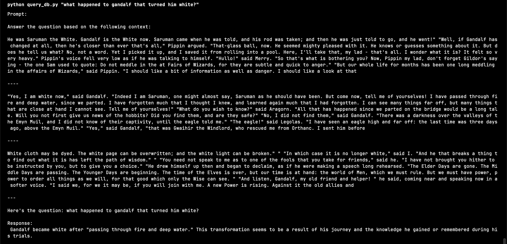
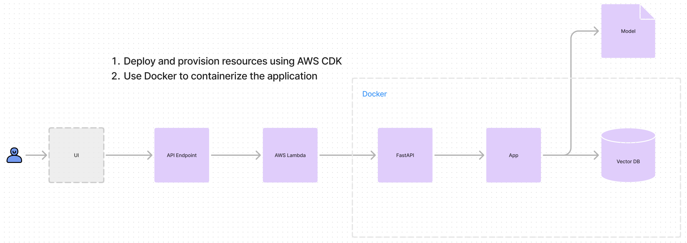

# answer-me-tolkien

This is a simple RAG application built using langchain and chroma database.

## How to use

1. Store the API key in the `.env` file.

2. Create a database

```bash
python -m src.create_db
```

3. Or update the database

```bash
python -m src.update_db
```

4. Query the llm with context from the vector db

```bash
python -m src.query_db "what happened to gandalf that turned him white?"
```

I have used cohere's embedding and the chat models.

> [!NOTE]
> If you want to run models locally, use Ollama

## Data I've used

I have used lotr books as the source data.

## Output I'm getting





---

Let's now extend this project to include a backend, frontend and deploy it to the cloud so that everyone can use the app.


