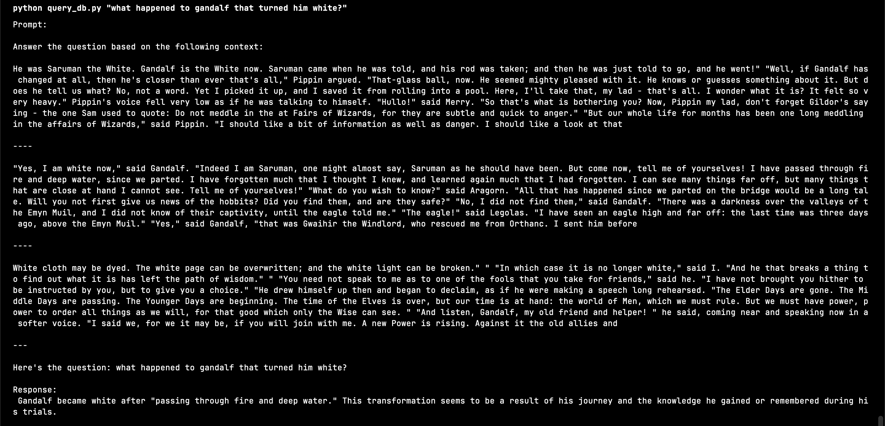

# answer-me-tolkien

This is a simple RAG application built using langchain and chroma database.

## How to use

1. Store the API key in the `.env` file.

2. Create a database

```bash
python -m rag_app_image.src.create_db
```

3. Or update the database

```bash
python -m rag_app_image.src.update_db
```

4. Query the llm with context from the vector db

```bash
python -m rag_app_image.src.query_db "what happened to gandalf that turned him white?"
```

I have used cohere's embedding and the chat models.

> [!NOTE]
> If you want to run models locally, use Ollama

## Data I've used

I have used lotr books as the source data.

## Output I'm getting





---

## Create a backend using Lambda on AWS

Let's now extend this project to include a backend, frontend and deploy it to the cloud so that everyone can use the app.


### Dockerize the app

Get the python base image from aws lambda.

> [!WARNING]
> Need to install pysqlite for chroma db to work correctly

We've also added an environment variable that checks if we're running the image on local. If yes, then we don't need pysqlite to be installed.

```dockerfile
# https://hub.docker.com/r/amazon/aws-lambda-python 
FROM public.ecr.aws/lambda/python:3.10

# Copy requirements.txt
COPY requirements.txt ${LAMBDA_TASK_ROOT}

# Install the necessary build tools
RUN yum update -y && yum install -y gcc

# Required to install chromadb https://docs.trychroma.com/troubleshooting
RUN pip install pysqlite3-binary

# Install the packages
RUN pip install -r requirements.txt --upgrade

# Local test
EXPOSE 8000

# Enviornment variable to check if we're running a container
ENV IS_CONTAINER_RUNTIME=True

# Copy all required files
COPY src/* ${LAMBDA_TASK_ROOT}/src
COPY chroma ${LAMBDA_TASK_ROOT}/chroma
COPY data ${LAMBDA_TASK_ROOT}/data
COPY api_handler.py ${LAMBDA_TASK_ROOT}
```

### Provision resources using AWS CDK

API Gateway has a time-limit of 30 seconds
Lambda functions have a 15 minute time-limit

### Dynamo DB for storing query-response

### Aysnc API for low latency

## Add a frontend

### API

### Render components

### Create an interface